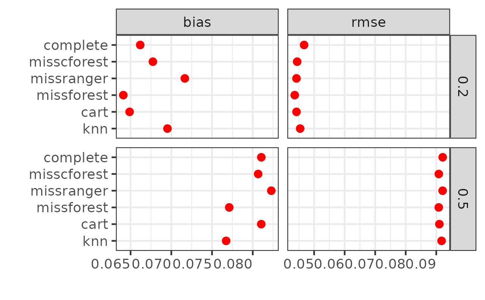

# `mcstatsim` package

## About

The `mcstatsim` package offers an efficient, functional
programming-based approach for statistical simulations, centralizing the
process in a **single higher-order function** for better manageability.
Besides, it includes ready-to-use functions for well-known **simulation
targets**.

## How?

The core `runsim()` function processes simulation parameters via
expanded grid, mapping them to the simulation function.

Replication management is performed through the `replicater()` function,
which estimates the remaining time (ETA) with an option to hide progress
via `show_progress = FALSE`. Outputs are deliberately structured as
dataframe to simplify analysis and visualization, addressing the
limitations of list outputs in data manipulation.

## Installation

You can install the latest development version of `mcstatsim` from
gitHub:

``` r
# install.packages("devtools")
#devtools::install_github("ielbadisy/mcstatsim")
```

## Usage

Here is a basic example to get you started with `mcstatsim`:

``` r
library(mcstatsim)

# Define a simple simulation function
sim_function <- function(a, b) {
  Sys.sleep(0.1)  # Simulate a time-consuming process
  return(data.frame(result = a + b))
  }

# Generate a grid of parameters
params <- expand.grid(a = 1:3, b = 4:6)

# Run simulations
results <- runsim(n = 3, grid_params = params, sim_func = sim_function)
```

This example demonstrates how to define a simple simulation function,
create a grid of parameters for the simulation, and run the simulations
in parallel using `mcstatsim`.

## Working example (more detailed)

To illustrate the utility of this package in a concrete example, we will
simulate the evaluation of several imputation methods to assess their
effectiveness in preserving the accuracy of coefficient estimates in a
Cox regression model. This will demonstrate the creation of a simulation
function, setting up parameters, and using `mcstatsim` to run these
simulations in parallel.

**Simulation aim**: We will to assess the performance of some imputation
methods regarding their capacity to preserve the values of coefficients
estimates. For this aim, we well set up the following simulation design:

1)  Generate fully observed data -\> `data_complete`

2)  estimate the beta coefficients values from `data_complete`

3)  Introduce missigness under MCAR to complete dataset generated in (1)
    -\> `data_missing`

4)  impute the dataset generated at (3) -\> `data_imputed`

5)  Use the following simulation targets to compute the distortion
    between beta from `data_complete` and beta `data_imputed`:

- **Bias**: Bias measures the average deviation of the estimated
  coefficients from the true coefficients.

$$\text{Bias} = \frac{1}{N} \sum_{i=1}^{N} (\hat{\beta}_i - \beta_{\text{true}})$$

- **Coverage**: Coverage is the proportion of times the true coefficient
  value falls within the estimated confidence interval across all
  simulations.

$$\text{Coverage} = \frac{1}{N} \sum_{i=1}^{N} \mathbf{1}(\beta_{\text{true}} \in \text{CI}_i)$$

- **Mean Squared Error (MSE)**: MSE combines both the variance of the
  estimator and its bias, providing a single measure of estimation
  quality.

$$\text{MSE} = \frac{1}{N} \sum_{i=1}^{N} (\hat{\beta}_i - \beta_{\text{true}})^2$$

*NB*: All these metrics are already implemented in the `mcstatsim`
package (see `?calc_bias()`, `?calc_coverage()`, and `?calc_rmse()`.

### Step 1: Define the helpers

Since we want to preserve the spirit of the functional prgramming style,
all our simulation design step will be decomposed as helper functions.
In others words, the simulation steps will be translated to functions as
follow:

``` r
pacman::p_load(mcstatsim, survival, dplyr, ggplot2)

## (1) generate fully observed data -> `data_complete`
gencox <- function(n = 300, maxTime = 7, logHR = 0.5) {
  lambda <- 0.1
  rho <- 1.6
  rateC <- 0.09

  # covariates
  x1 <- rnorm(n)
  x2 <- x1^2 + x1 + runif(n)
  x3 <- rbinom(n, 1, 0.5)

  # estimated survival times
  U <- runif(n)
  Tlat <- (-log(U) / (lambda * exp(logHR * (x1 + x2 + x3))))^(1 / rho)
  Ctimes <- rexp(n, rate = rateC)

  # follow-up times and event indicators
  time <- pmin(Tlat, Ctimes)
  status <- as.numeric(Tlat <= Ctimes)
  time <- ifelse(time > maxTime, maxTime, time)
  status <- ifelse(time >= maxTime, 1, status)
  
  data <- data.frame(time, status, x1, x2, x3)
  data$x3 <- as.factor(data$x3)
  
  return(data)
  }

## (2) estimate the beta coefficients values from `data_complete`
estimate_coxest <- function(data) {
  myFormula <- survival::Surv(time, status) ~ x1 + x2 + x3
  coefs <- summary(survival::coxph(myFormula, data = data))$coef
  coefs[, 1]
}

## (3) introduce missigness under MCAR to complete dataset generated in (1) -> `data_missing`
introduce_MCAR <- function(x, covariates = names(x), p = 0.3) {
  
  stopifnot(is.data.frame(x), p >= 0 && p <= 1, all(covariates %in% names(x)))
  x[covariates] <- lapply(x[covariates], function(z) {
    z[sample(length(z), floor(p * length(z)))] <- NA
    z
  })
  
  return(x)
}

## (4) impute the dataset generated at (3) -> `data_imputed`
imputer <- function(data, method) {
  stopifnot(is.data.frame(data))
  if (is.factor(method)) {method <- as.character(method)}

  supported_methods <- c("knn", "cart", "missforest", "missranger", "misscforest", "complete")
  stopifnot(method %in% supported_methods)
  
  data_imputed <- switch(method,
                 knn = VIM::kNN(data)[names(data)],
                 cart = simputation::impute_cart(data, .~.),
                 missforest = missForest::missForest(data, xtrue = data, verbose = FALSE)$ximp,
                 missranger = missRanger::missRanger(data, pmm.k = 5, num.trees = 100, verbose = 0),
                 misscforest = suppressWarnings(missCforest::missCforest(data, ntree = 10L)),
                 complete = data[stats::complete.cases(data), ])
  
  return(data_imputed)
  }

## (5) compute the simulation targets
evaluate_coxest <- function(data, truelogHR) {
  myFormula <- survival::Surv(time, status) ~ x1 + x2 + x3
  coefs <- summary(survival::coxph(myFormula, data = data))$coef
  estimates <- as.data.frame(coefs)
  
  out <- data.frame(
    estimates = estimates$coef,
    ci_lower = estimates$coef - 1.96 * estimates$`se(coef)`,
    ci_upper = estimates$coef + 1.96 * estimates$`se(coef)`
    )
  
  out$bias <- mcstatsim::calc_bias(out$estimates, truelogHR)$bias
  out$coverage <- mcstatsim::calc_coverage(out$ci_lower, out$ci_upper, truelogHR)$coverage
  out$rmse <- mcstatsim::calc_rmse(out$estimates, truelogHR)$rmse
  
  return(out)
  }
```

## Step 2: Define the simulation function

``` r
simcox <- function(n, logHR, pmiss, covariates = c("x2"), method = method){
  data_complete <- gencox(n = n)
  truelogHR <- estimate_coxest(data_complete)
  data_missing <- introduce_MCAR(data_complete, covariates = covariates, p = pmiss)
  data_imputed <- imputer(data_missing, method = method)
  res_est <- evaluate_coxest(data_missing, truelogHR = truelogHR)
  res <- cbind(n, pmiss, method, covariates, res_est, row.names = NULL)
  return(res)
  }
```

## Step 3: define the parameters of the simulation

Now, to link our simulation function to the simulation parameters, we
will generate a grid of paremeters with the same names as the argument
of simulation function:

``` r
params <- expand.grid(n = c(200, 500), 
                      logHR = 0.5,
                      pmiss = c(0.2, 0.5),
                      method = c("knn", "cart", "missforest", "missranger",
                                 "misscforest", "complete"))
```

## Step 4: Run the simulation

In one line of code, we can lunch our simulation:

``` r
pacman::p_load(survival, missRanger, missCforest, missForest, VIM, simputation, ggplot2, tidyr)
sim_res <- mcstatsim::runsim(n = 3, grid_params = params, sim_func = simcox)
```

### Step 5: summerize the results

Finaly, we retreive all the results in one single dataset (i.e
`sim_res`) for ploting and table production:

``` r
sim_res$bias <- abs(sim_res$bias)

sim_res2 <- gather(sim_res, metric, value, c(bias, rmse))
ggplot(sim_res2, aes(x=value, y=method, fill=method)) +
  stat_summary(fun=mean, geom="point", shape=20, size=3, color="red") + 
  theme_bw() +
  theme(axis.text.x = element_text(hjust = 1),
        legend.position = "none") +
  labs(x = "", y = "") +
  facet_grid(pmiss~metric, scales="free")

#ggsave("quick_res.png")
```



``` r
library(dplyr)
summary_table <- sim_res %>%
  group_by(n, pmiss, method) %>%  # Group by number of observations, missingness, and method
  summarise(
    Mean_Estimate = mean(estimates),
    Mean_CI_Lower = mean(ci_lower),
    Mean_CI_Upper = mean(ci_upper),
    Mean_Bias = mean(bias),
    Coverage = mean(coverage),
    Mean_RMSE = mean(rmse),
    .groups = 'drop' 
  )

knitr::kable(summary_table, format = "markdown", caption = "Summary of Simulation Results")
```

Let’s skip interpreting the results since the simulation design isn’t
complete yet—we need to add more simulation targets and assess different
hyperparameter values. However, this provides a good demonstration of
how the `mcstatsim` package can efficiently organize Monte Carlo
simulations without the complexities of for-loops and managing numerous
parameters.

## Features

- **No Dependencies**: `mcstatsim` is designed to be lightweight and
  standalone, requiring no additional packages for its core
  functionalities, simplifying installation and usage.

- **Functional programming approach**: Streamlines the process of
  setting up and running simulations.

- **Parallel execution**: Leverages multiple cores to speed up the
  execution of simulations.

- **Structured output**: Returns simulation results in a dataframe,
  facilitating quick analysis and visualization.

## Contributing

Contributions are welcome! If you’d like to help improve `mcstatsim`,
please feel free to submit a pull request.
