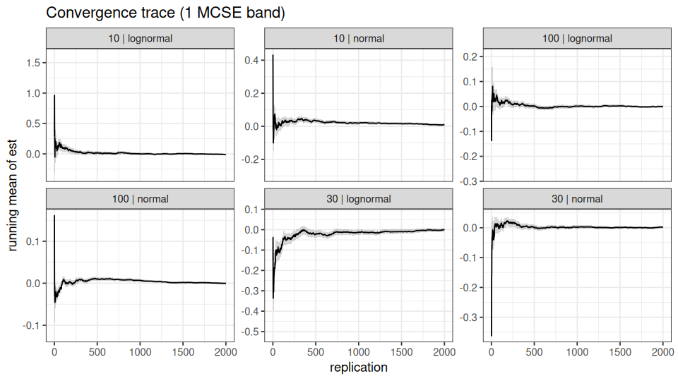
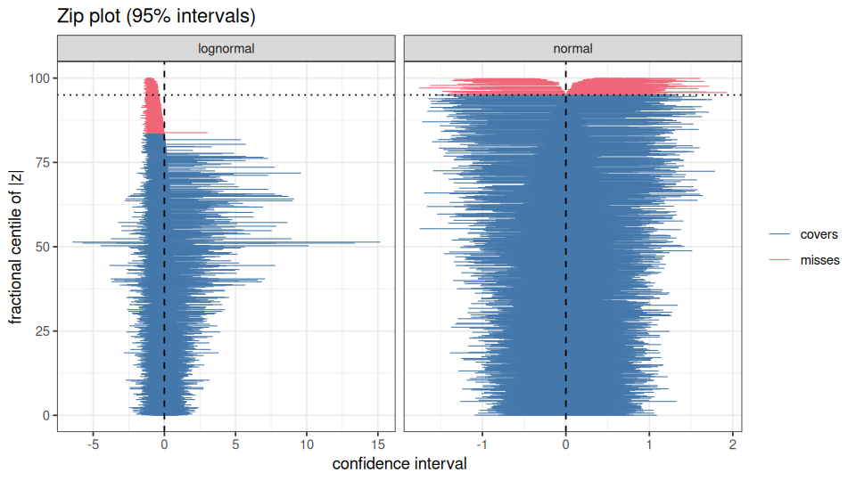
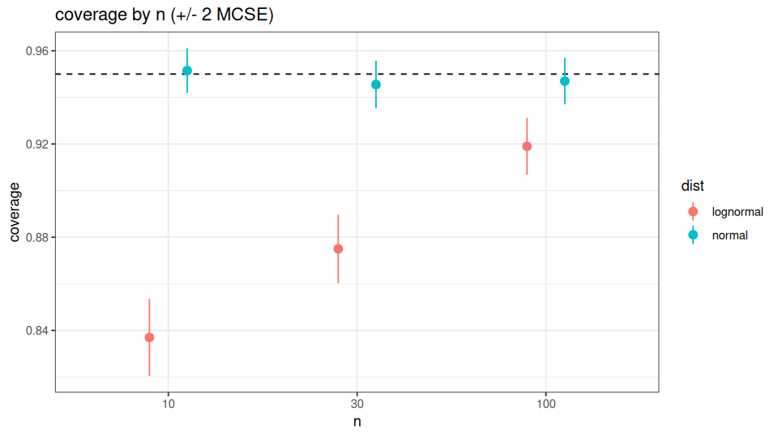

# `mcstatsim`

<!-- badges: start -->

[](https://CRAN.R-project.org/package=mcstatsim)
[](https://CRAN.R-project.org/package=mcstatsim)
[](https://github.com/ielbadisy/mcstatsim/actions/workflows/R-CMD-check.yaml)
[](https://lifecycle.r-lib.org/articles/stages.html#stable)
[](https://www.gnu.org/licenses/agpl-3.0)
<!-- badges: end -->

## About

`mcstatsim` is a lightweight, functional-style toolkit for Monte Carlo
simulation studies. Its core is a **higher-order driver**, `runsim()`: you write
the simulation as a function of its parameters, and `runsim()` maps it over a
grid of conditions, owning the iteration, parallelism, reproducible
random-number streams, error capture and result assembly. Around it the package
ships ready-to-use **performance measures**, an **evaluation layer** that turns
raw replicates into a tidy results table, and **diagnostic plots**.

The only hard dependency is `functionals`. `ggplot2` is used by the plotting
helpers and is optional.

## How it works

`runsim()` takes a grid of conditions (one row per scenario), a simulation
function whose arguments match the grid columns, and the number of
replications. It builds one flat list of `n * nrow(grid)` jobs, runs them in a
single load-balanced parallel pass, and row-binds the results into a data frame
with the grid columns, the quantities returned by the simulation function, and a
replication index `ID`.

## Installation

``` r
install.packages("mcstatsim")            # released version
# install.packages("devtools")
devtools::install_github("ielbadisy/mcstatsim")  # development version
```

## A complete example

We evaluate the normal-theory 95% confidence interval for a mean when the data
are drawn either from a normal distribution or from a skewed (centred
log-normal) distribution, across three sample sizes. The true mean is `0` in
every cell, so we expect bias near zero and coverage near 0.95, but the
`t`-interval is known to under-cover under skew at small `n`.

### 1. Simulation function and grid

``` r
library(mcstatsim)

sim_mean_ci <- function(n, dist) {
  x <- if (dist == "normal") rnorm(n) else rlnorm(n) - exp(0.5)  # both have mean 0
  est <- mean(x)
  se  <- sd(x) / sqrt(n)
  crit <- qt(0.975, df = n - 1)
  data.frame(
    est      = est,
    lo       = est - crit * se,
    hi       = est + crit * se,
    true_val = 0
  )
}

grid <- expand.grid(n = c(10, 30, 100), dist = c("normal", "lognormal"),
                    stringsAsFactors = FALSE)
grid
#>     n      dist
#> 1  10    normal
#> 2  30    normal
#> 3 100    normal
#> 4  10 lognormal
#> 5  30 lognormal
#> 6 100 lognormal
```

### 2. Run the simulation

`seed` gives every job its own independent `L'Ecuyer-CMRG` stream, so the run is
reproducible and does not depend on the number of cores.

``` r
res <- runsim(
  n           = 2000,
  grid_params = grid,
  sim_func    = sim_mean_ci,
  seed        = 2025,
  num_cores   = 2,
  show_progress = FALSE
)

head(res)
#>     n      dist          est          lo         hi true_val ID
#> 1  10    normal  0.433489939 -0.35003582 1.21701569        0  1
#> 2  30    normal -0.363420104 -0.74905905 0.02221884        0  1
#> 3 100    normal  0.162087539 -0.03781371 0.36198879        0  1
#> 4  10 lognormal  0.292061905 -1.37614955 1.96027336        0  1
#> 5  30 lognormal -0.147570162 -0.56076715 0.26562683        0  1
#> 6 100 lognormal  0.004260512 -0.37423359 0.38275461        0  1
nrow(res)
#> [1] 12000
```

### 3. Turn replicates into a performance table

``` r
perf <- summarise_sim(
  res,
  by = c("n", "dist"),
  measures = list(
    bias     = ~ calc_bias(est, true_val[1]),
    coverage = ~ calc_coverage(lo, hi, true_val[1]),
    width    = ~ calc_width(lo, hi)
  )
)
perf
#>     n      dist n_sim          bias   bias_mcse coverage coverage_mcse
#> 1  10 lognormal  2000 -0.0112783788 0.015265279   0.8370   0.008259268
#> 2  10    normal  2000  0.0091781423 0.006846178   0.9515   0.004803527
#> 3  30 lognormal  2000 -0.0008619737 0.008962467   0.8750   0.007395100
#> 4  30    normal  2000  0.0016265874 0.004160230   0.9455   0.005075911
#> 5 100 lognormal  2000 -0.0006907869 0.004822183   0.9190   0.006100779
#> 6 100    normal  2000 -0.0003597858 0.002255103   0.9470   0.005009541
#>       width  width_mcse
#> 1 2.4341283 0.039559470
#> 2 1.3913083 0.007452100
#> 3 1.4439614 0.018121420
#> 4 0.7402221 0.002201001
#> 5 0.8079286 0.006179344
#> 6 0.3956937 0.000631265
```

Each `calc_*` measure contributes its estimate and its Monte Carlo standard
error (the `*_mcse` columns).

### 4. Diagnostics

Check that no replicate produced a non-finite estimate:

``` r
check_estimates(res, by = c("n", "dist"))
#> [1] n        dist     column   n_bad    n_total  prop_bad
#> <0 rows> (or 0-length row.names)
```

How many replications would we need to pin the coverage MCSE down to 0.0025?

``` r
data.frame(perf[c("n", "dist")],
           coverage_mcse = round(perf$coverage_mcse, 4),
           reps_for_0.0025 = mcse_target(perf$coverage_mcse, perf$n_sim, target = 0.0025))
#>     n      dist coverage_mcse reps_for_0.0025
#> 1  10 lognormal        0.0083           21829
#> 2  10    normal        0.0048            7384
#> 3  30 lognormal        0.0074           17500
#> 4  30    normal        0.0051            8245
#> 5 100 lognormal        0.0061           11911
#> 6 100    normal        0.0050            8031
```

### 5. Plots

**Convergence trace.** The running mean of the point estimate with a
Monte Carlo standard-error band, one panel per condition:

``` r
plot_convergence(res, "est", by = c("n", "dist"))
```

<!-- -->

**Zip plot** (Morris, White and Crowther, 2019). Confidence intervals sorted by
the extremeness of their z-statistic and coloured by whether they cover; a
well-calibrated interval fills the panel up to the nominal line in the
“covers” colour. Shown here for `n = 10`:

``` r
plot_zip(res[res$n == 10, ], "lo", "hi", "true_val", by = "dist")
```

<!-- -->

**Performance across the design.** Coverage with a `+/- 2 MCSE` bar against
the nominal 0.95 line:

``` r
plot_performance(perf, "coverage", x = "n", colour = "dist", ref = 0.95)
```

<!-- -->

The log-normal intervals under-cover at `n = 10` (the zip plot shows the misses
concentrated on one side, the signature of skew) and climb back toward 0.95 as
`n` grows. The normal-data intervals sit on 0.95 throughout.

## Reproducibility and error handling

``` r
a <- runsim(200, grid, sim_mean_ci, seed = 1, num_cores = 1, show_progress = FALSE)
b <- runsim(200, grid, sim_mean_ci, seed = 1, num_cores = 4, show_progress = FALSE)
identical(a$est, b$est)
#> [1] TRUE
```

If a simulation function errors on some cells, `on_error = "warn"` (or
`"omit"`) drops those jobs and records them in `attr(x, "errors")`, which
`failure_summary()` aggregates per condition. A `save_path` makes a long run
resumable: it is checkpointed after each chunk of replications and re-running
`runsim()` with the same `save_path` picks up where it stopped.

## Performance measures

`calc_bias()`, `calc_variance()`, `calc_mse()`, `calc_rmse()`,
`calc_coverage()`, `calc_width()`, `calc_rejection_rate()`,
`calc_relative_bias()`, `calc_relative_mse()`, `calc_relative_rmse()`. Each
returns the estimate together with its Monte Carlo standard error.

## Features

- **Higher-order, declarative interface:** write the simulation as a function; `runsim()` maps it over the design.
- **Reproducible parallelism:** per-job RNG streams; results independent of core count.
- **Robustness:** per-cell error/warning capture, checkpoint/resume for long runs.
- **Evaluation layer:** `summarise_sim()` plus a full set of MCSE-aware measures.
- **Diagnostics:** convergence traces, zip plots, performance plots, non-finite checks.

## Contributing

Contributions are welcome. Please feel free to open an issue or submit a pull
request.
